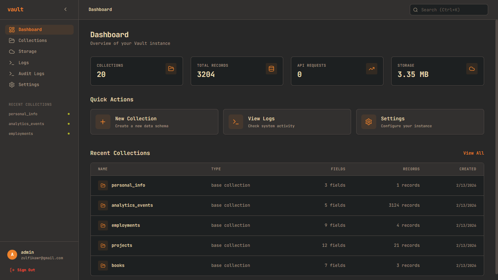

# Vault



Vault is a self-contained, batteries-included backend framework written in Go. It provides a dynamic database schema engine, robust authentication, real-time subscriptions, and a professional administrative dashboard—all delivered as a single, lightweight binary.

## ✨ Features

- **Embedded SQLite**: Pure-Go SQLite implementation (`modernc.org/sqlite`) with WAL mode enabled for high-concurrency performance.
- **Dynamic Schema Engine**: Create and modify "Collections" (tables) and "Fields" (columns) on the fly via the API or Admin UI with support for multiple field types (text, number, boolean, date, json).
- **Auto-Migrations**: The framework automatically handles SQLite table creation and schema synchronization with `vault migrate` commands.
- **Identity & Auth**: Full JWT-based authentication with Bcrypt password hashing, session refresh tokens, and a protected middleware chain. Admin user management via CLI.
- **Rule-Based Authorization**: Fine-grained, record-level security using simple string expressions (e.g., `id = @request.auth.id`).
- **Real-time Subscriptions**: Instant event broadcasting using Server-Sent Events (SSE).
- **File Storage**: Pluggable storage system with a built-in local filesystem driver and multipart upload support.
- **Storage Management CLI**: Manage files directly from the command line with `vault storage` commands (list, create, get, delete) with recursive operations and path traversal protection.
- **Backup & Restore**: Full database and storage backup/restore capabilities with `vault backup` commands (create, list, restore).
- **Embedded Admin Dashboard**: A professional, Gruvbox-themed management interface built with Vue 3 and Vite, embedded directly into the binary with real-time UI updates.
- **Comprehensive Developer CLI**: Full-featured CLI for managing collections, storage, backups, migrations, and admin users with authentication and confirmation prompts.
- **Single Binary Distribution**: Pre-built binaries for Linux, macOS, and Windows (amd64/arm64) with one-line installation script.

## 🚀 Quick Start

### 1. Install Vault
**Linux/macOS (one-line installation):**
```bash
curl -fsSL https://raw.githubusercontent.com/zulfikawr/vault/main/install.sh | bash
```

**Or download from [GitHub Releases](https://github.com/zulfikawr/vault/releases)**

### 2. Initialize Vault
```bash
vault init --email "email@example.com" --password "yourpassword" --username "yourusername"
```

### 3. Start the server
```bash
vault serve
```

Visit `http://localhost:8090/_/` to access the Admin Dashboard.

## 🛠 CLI Usage

### `vault init`

Initialize new Vault project with admin user and database.

| Flag | Type | Default | Required | Description |
|------|------|---------|----------|-------------|
| `--email` | string | | Yes | Admin email address |
| `--username` | string | | Yes | Admin username |
| `--password` | string | | Yes | Admin password |
| `--dir` | string | ./vault_data | No | Custom data directory |
| `--skip-admin` | bool | false | No | Skip admin creation |
| `--force` | bool | false | No | Overwrite existing setup |

---

### `vault serve`

Start the HTTP server.

| Flag | Type | Default | Required | Description |
|------|------|---------|----------|-------------|
| `--port` | int | 8090 | No | Server port |
| `--dir` | string | ./vault_data | No | Data directory |

---

### `vault admin create`

Create new admin user.

| Flag | Type | Required | Description |
|------|------|----------|-------------|
| `--email` | string | Yes | Admin email address |
| `--password` | string | Yes | Admin password |
| `--username` | string | Yes | Admin username |

---

### `vault admin list`

List all admin users.

No flags required.

---

### `vault admin delete`

Delete admin user.

| Flag | Type | Required | Description |
|------|------|----------|-------------|
| `--email` | string | Yes | Admin email to delete |
| `--force` | bool | No | Skip confirmation prompt |

---

### `vault admin reset-password`

Reset admin password.

| Flag | Type | Required | Description |
|------|------|----------|-------------|
| `--email` | string | Yes | Admin email |
| `--password` | string | Yes | New password |

---

### `vault collection create`

Create new collection.

| Flag | Type | Required | Description |
|------|------|----------|-------------|
| `--name` | string | Yes | Collection name |
| `--fields` | string | Yes | Fields format: `name:type[,name:type,...]` |
| `--email` | string | Yes | Admin email |
| `--password` | string | Yes | Admin password |

**Field types:** text, number, boolean, date, json

---

### `vault collection list`

List all collections.

| Flag | Type | Required | Description |
|------|------|----------|-------------|
| `--email` | string | Yes | Admin email |
| `--password` | string | Yes | Admin password |

---

### `vault collection get`

Get collection details.

| Flag | Type | Required | Description |
|------|------|----------|-------------|
| `--name` | string | Yes | Collection name |
| `--email` | string | Yes | Admin email |
| `--password` | string | Yes | Admin password |

---

### `vault collection delete`

Delete collection.

| Flag | Type | Required | Description |
|------|------|----------|-------------|
| `--name` | string | Yes | Collection name |
| `--email` | string | Yes | Admin email |
| `--password` | string | Yes | Admin password |
| `--force` | bool | No | Skip confirmation prompt |

---

### `vault storage list`

List files and folders in storage.

| Flag | Type | Required | Description |
|------|------|----------|-------------|
| `--path` | string | No | Storage path to list |
| `--recursive` | bool | No | List recursively |
| `--email` | string | Yes | Admin email |
| `--password` | string | Yes | Admin password |

---

### `vault storage create`

Upload file to storage.

| Flag | Type | Required | Description |
|------|------|----------|-------------|
| `--path` | string | Yes | Storage path |
| `--file` | string | Yes | File to upload |
| `--email` | string | Yes | Admin email |
| `--password` | string | Yes | Admin password |

---

### `vault storage get`

Download file from storage.

| Flag | Type | Required | Description |
|------|------|----------|-------------|
| `--path` | string | Yes | File path in storage |
| `--output` | string | Yes | Output file path |
| `--email` | string | Yes | Admin email |
| `--password` | string | Yes | Admin password |
| `--force` | bool | No | Overwrite output file |

---

### `vault storage delete`

Delete file or folder from storage.

| Flag | Type | Required | Description |
|------|------|----------|-------------|
| `--path` | string | Yes | Path to delete |
| `--recursive` | bool | No | Delete directory recursively |
| `--force` | bool | No | Skip confirmation prompt |
| `--email` | string | Yes | Admin email |
| `--password` | string | Yes | Admin password |

---

### `vault backup create`

Create backup of database and storage.

| Flag | Type | Default | Required | Description |
|------|------|---------|----------|-------------|
| `--output` | string | vault_backup_TIMESTAMP.zip | No | Output file path |

---

### `vault backup list`

List all backups.

No flags required.

---

### `vault backup restore`

Restore from backup.

| Flag | Type | Required | Description |
|------|------|----------|-------------|
| `--input` | string | Yes | Backup file path |
| `--force` | bool | No | Skip confirmation prompt |

---

### `vault migrate sync`

Synchronize database schema with collections.

| Flag | Type | Required | Description |
|------|------|----------|-------------|
| `--collection` | string | No | Specific collection to sync |
| `--verbose` | bool | No | Verbose output |

---

### `vault migrate status`

Show current database and collection status.

No flags required.

---

### `vault version`

Display current version.

No flags required.

## 🏗 Project Structure

```
vault/
├── cmd/vault/                  # CLI Entry point
├── internal/
│   ├── api/                    # REST API Handlers & Routing
│   │   ├── auth_handlers.go
│   │   ├── crud_handlers.go
│   │   ├── files_handlers.go
│   │   ├── storage_handlers.go
│   │   ├── admin_handlers.go
│   │   ├── middleware.go
│   │   └── router.go
│   ├── auth/                   # JWT & Password Security
│   │   ├── jwt.go
│   │   └── password.go
│   ├── cli/                    # CLI Commands
│   │   ├── admin.go
│   │   ├── backup.go
│   │   ├── collection.go
│   │   ├── init.go
│   │   ├── migrate.go
│   │   └── storage.go
│   ├── core/                   # Config, Logger, & Error System
│   │   ├── config.go
│   │   ├── logger.go
│   │   ├── file_logger.go
│   │   └── context.go
│   ├── db/                     # Schema Registry, Migration, & Executor
│   │   ├── connection.go
│   │   ├── executor.go
│   │   ├── schema.go
│   │   ├── migration.go
│   │   ├── query_builder.go
│   │   ├── validator.go
│   │   ├── audit.go
│   │   └── hooks.go
│   ├── errors/                 # Error Handling System
│   │   └── errors.go
│   ├── models/                 # Collection & Record Definitions
│   │   ├── collection.go
│   │   ├── field.go
│   │   ├── record.go
│   │   ├── user.go
│   │   └── file.go
│   ├── realtime/               # SSE Hub & Event System
│   │   ├── hub.go
│   │   └── message.go
│   ├── rules/                  # Authorization Rules Engine
│   │   └── evaluator.go
│   ├── server/                 # App Lifecycle & Server Management
│   │   ├── app.go
│   │   └── server.go
│   └── storage/                # Pluggable File Storage Drivers
│       ├── interface.go
│       └── local.go
├── ui/                         # Vue 3 Admin Dashboard
│   ├── src/
│   │   ├── components/         # Reusable Vue Components
│   │   ├── views/              # Page Components
│   │   ├── stores/             # Pinia State Management
│   │   ├── router/             # Vue Router Configuration
│   │   └── main.ts
│   ├── index.html
│   ├── vite.config.ts
│   └── tailwind.config.js
├── .github/workflows/          # CI/CD Workflows
├── go.mod & go.sum             # Go Dependencies
├── Makefile                    # Build & Development Tasks
├── CHANGELOG.md                # Version History
└── vault_data/                 # Default data directory (SQLite + Storage)
    ├── vault.db                # SQLite Database
    ├── vault.log               # Application Logs
    └── storage/                # File Storage
```